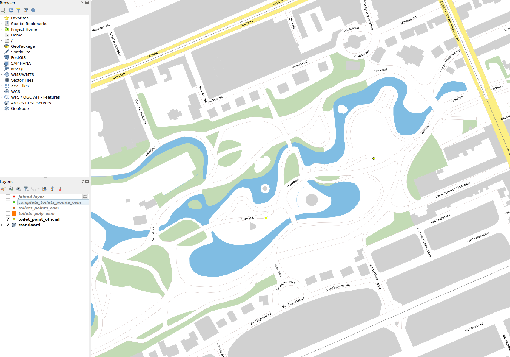
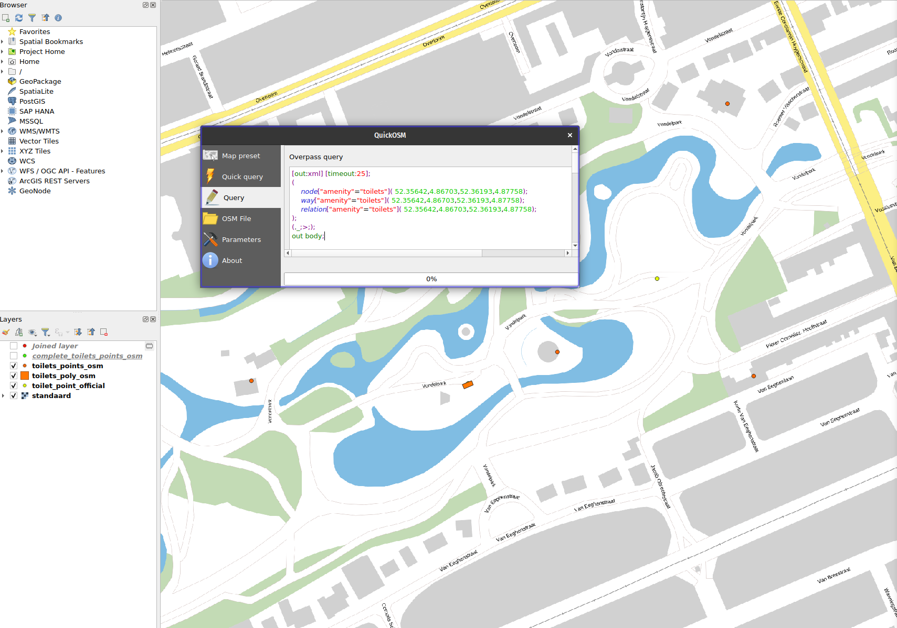
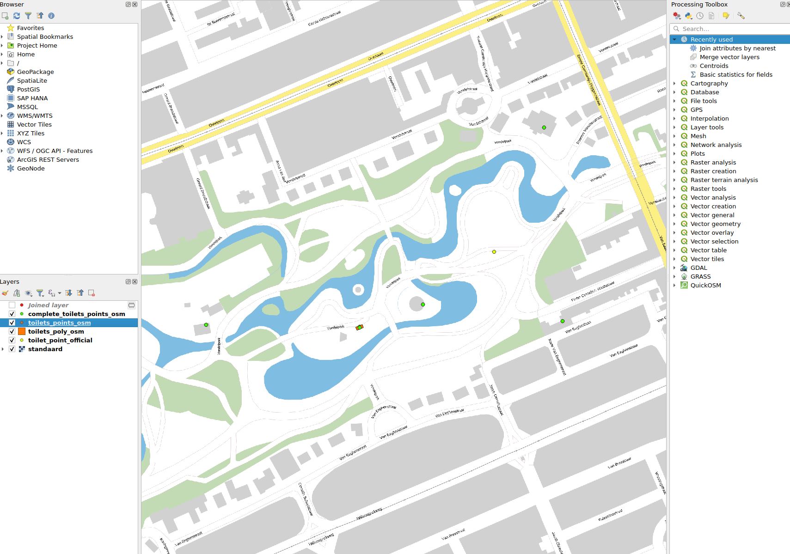
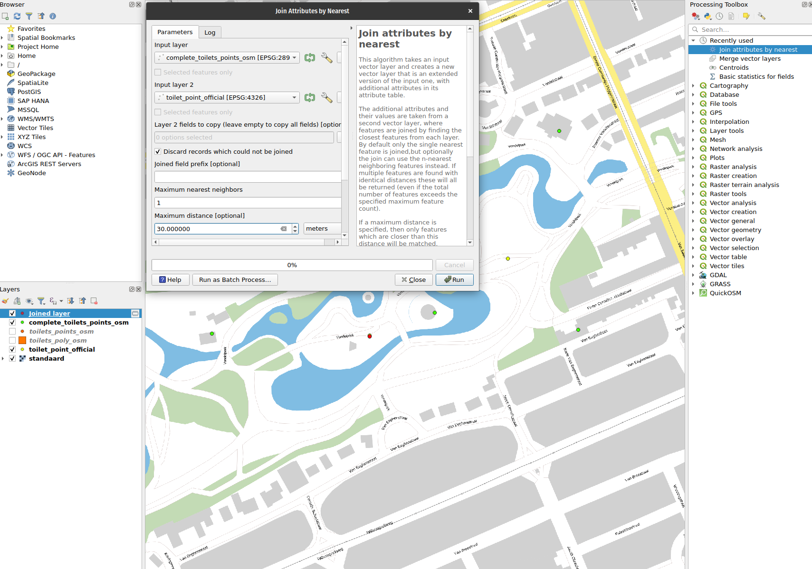

# Introduction
This document is divided into two parts.

1. Recolletion of results from the tutorial part and explaination of the results.
2. The second part is about public restroom data comparison.

# 1. Tutorial results
## 1.1 Extent
- Extent:
    - 113946.696061
    - 129229.925377
    - 478467.567555
    - 492735.303889

## 1.2 Polygon resolution
Smallest distinguishable length : 0.02~ meter in 209 MultiPolygonfeatures

## 1.3 Completeness
61 matched schools / 75 schoolwijzer schools. = 0.813 = 81%

## 1.4 Spatial accuracy
Mean of 44.55~ meters of distance between pairs. 

# 2. Public toilet comparison

## 2.1 Data used
Official public toilet source: `https://maps.amsterdam.nl/open_geodata/geojson_lnglat.php?KAARTLAAG=OPENBARE_TOILETTEN&THEMA=openbare_toiletten`

OSM comparison: 
```xml
[out:xml] [timeout:25];
(
    node["amenity"="toilets"]( 52.35642,4.86703,52.36193,4.87758);
    way["amenity"="toilets"]( 52.35642,4.86703,52.36193,4.87758);
    relation["amenity"="toilets"]( 52.35642,4.86703,52.36193,4.87758);
);
(._;>;);
out body;
```

## 2.2 Process

### 2.2.1 Preperation
- Official toilets: **Lemon yellow**.
- OSM toilets point & polygon: **Orange**.
- Complete OSM point layer: **Lime green**.
- Merged layer offical and OSM: **Red**.

1. Add vector layer of the official points. 
2. Add all public toilets available through OSM based on the offical data's bounding box. 
3. Join OSM polygons with points layer by getting the center of all polygons and merging both layers. 
4. Inner-join the OSM & Official layer by distance. 
    - Max distance of 30 meters.
    - Discarding non matching records.

## 2.3 Qualitative measures.
### 2.3.1 Extend
- Extent:
    - 113782.540465
    - 129637.376003
    - 478513.372596
    - 491105.188704

Comparing the extend of the toilet data is interesting, these results are really close to the school data. This tells us the restrooms are not only  situated in the busy city-center but just as sprawling as the primary-schools around amsterdam.

### 2.3.2 Completeness
113 Public toilets in official data, 52 public toilets form joined sources.

`52 / 113 = 0.46%~`

The discrepancy between these two is rather large, but looking into the missing items most are annotated as public toilets is some publicly accesible buildings opposed to completele open restrooms out in the open in public. This might be more an interpretation/ classification problem by OSM.

### 2.3.3 Spatial accuracy
- Distance:
    - Min: 0.22
    - Mean: 5.47
    - Median': 3.92

The last claims can be better backed-up by the fact that the difference in location distance really is small so there is not a problem of accuracy but of scope of this specific amenity.