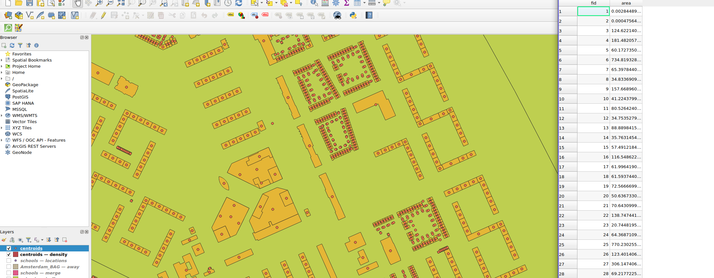

# 2
## 2.1 Querying datasets
Task: Print the number of layers included in the dataset.
`5`

Task: Print for each layer the layer name and CRS.

```
Name: Pand
Srs: Amersfoort / RD New, EPSG, 28992

Name: Verblijfsobject
Srs: Amersfoort / RD New, EPSG, 28992

Name: Wijken
Srs: Amersfoort / RD New, EPSG, 28992

Name: merge
Srs: Amersfoort / RD New, EPSG, 28992

Name: away
Srs: Amersfoort / RD New, EPSG, 28992
```

Task: Print the number of features in the layer.
```
N building features: 496420
```

Task: Print the name and type of each field in the layer
```
field name: oppervlakte, field type: Integer
field name: gebruiksdoel, field type: String
```

Question: What is the total surface area given in the location layer?
```
Total area of `buildings`: 59254587
```
Question: What is the coordinate of the feature with the index 439774?
```
Coordinates of 439774, X: 121815.991, Y: 487912.647
```
## 2.2 Obtaining building properties
Image of centroids and area & density calculation

## 2.3 Computing building densities
Question: What is the density of the district with feature id 54 (Museumkwartier)?
`0.0021170744760404285`

# 3
## 3.1 Adding buffer areas around schools
Question: What kind of geometry type does the layer buffer need to be?
`Polygon`. This is the reason because you are drawing circles around the points.

## 3.2 Merging geometrie
Question: What kind of geometry type does the layer merge need to be?
`MultiPolygon`. Polygon seems to give warnings against my instinct, it seems that merged polygons are defined as a multipolygon.`

## 3.3 Compute area far from schools
Question: Which operation will you use to compute the area far away from schools?
`Erase`

Question: What is the size of the area considered as far away from public schools?
`18.670070138402487 km2`


<div class="page"/>

2.1 `explore_bag.py`
```python
from osgeo import gdal, ogr
from multiprocessing import Pool

filename = "labs/lab2/Lab 2 - data/Amsterdam_BAG.gpkg"
data_source = ogr.GetDriverByName('GPKG').Open(filename, update=0)
n_layers = data_source.GetLayerCount()
print(f"Task: Print the number of layers included in the dataset.\n{n_layers}\n")

print(f"Task: Print for each layer the layer name and CRS.")
for layer_index in range (n_layers):
    layer = data_source.GetLayerByIndex(layer_index)
    srs = layer.GetSpatialRef()
    print(f"Name: {layer.GetName()}\nSrs: {srs.GetName()}, {srs.GetAuthorityName(None)}, {srs.GetAuthorityCode(None)}\n")

buildings = data_source.GetLayerByName('Verblijfsobject')
n_building_features = buildings.GetFeatureCount()
print(f"Task: Print the number of features in the layer.\nN building features: {n_building_features}\n")

locations_def = buildings.GetLayerDefn()
field_count = locations_def.GetFieldCount()
print(f"Task: Print the name and type of each field in the layer")
for i in range(field_count):
    field_name = locations_def.GetFieldDefn(i).GetName()
    print(f"field name: {field_name}, field type: {locations_def.GetFieldDefn(i).GetTypeName()}")

# total_area = 0
# for i in range(1, n_building_features):
#     feature = buildings.GetFeature(i)
#     total_area += feature.GetField('oppervlakte')

# print(total_area)

def calculate_area(feature):
    return feature.GetField('oppervlakte')

n_cores = 6
chunk_size = n_building_features // n_cores

def process_chunk(chunk):
    return sum(calculate_area(buildings.GetFeature(i)) for i in chunk)

with Pool(n_cores) as pool:
    total_area = sum(pool.map(process_chunk, [range(i, min(i + chunk_size, n_building_features)) for i in range(1, n_building_features, chunk_size)]))
print(f"Task: Add code to your script that iterates over all features in the layer, retrieves the value of the field oppervlakte (surface area) and adds up the area.\nTotal area of `buildings`: {total_area}\n")

f = buildings.GetFeature(439774)
geom = f.GetGeometryRef()
x, y = geom.GetX(), geom.GetY()
print(f"Question: What is the total surface area given in the location layer?\nCoordinates of 439774, X: {x}, Y: {y}")
```


<div class="page"/>


2.2 `building_surface_areas.py`
```python
from osgeo import gdal, ogr
from osgeo.osr import SpatialReference

filename = "labs/lab2/Lab 2 - data/Amsterdam_BAG.gpkg"
data_source = ogr.GetDriverByName('GPKG').Open(filename, update=0)
pand = data_source.GetLayerByName('pand')

rdNew = SpatialReference()
rdNew.ImportFromEPSG(28992)

centroid_source = ogr.GetDriverByName('GPKG').CreateDataSource('labs/lab2/Lab 2 - data/centroids.gpkg')
centroid_layer = centroid_source.CreateLayer('centroids', srs=rdNew, geom_type=ogr.wkbPoint)

# Example: Delete a layer
# if data_source.GetLayerByName(layername):
    # data_source.DeleteLayer(layername)

# Example: Adding field holding floats to layer.
# field = ogr.FieldDefn('area', ogr.OFTReal)
# layer.CreateField(field)
"""
Task: Add a field area to your layer centroids
"""
field = ogr.FieldDefn('area', ogr.OFTReal)
centroid_layer.CreateField(field)

centroid_layer_def = centroid_layer.GetLayerDefn()
for feature in pand:
    house_geometry = feature.GetGeometryRef()
    centroid = house_geometry.Centroid()
    house_area = house_geometry.GetArea()
    """
    Task: Calculate the area and the centroid location of each building.
    """
    point_feature = ogr.Feature(centroid_layer_def)
    point = ogr.Geometry(ogr.wkbPoint)
    point.AddPoint(centroid.GetX(), centroid.GetY())
    point_feature.SetGeometry(point)
    point_feature.SetField('area', house_area)
    centroid_layer.CreateFeature(point_feature)
```

<div class="page"/>


2.3 `densities.py`
```python
from osgeo import gdal, ogr
from osgeo.osr import SpatialReference
import os

rdNew = SpatialReference()
rdNew.ImportFromEPSG(28992)

folder = "labs/lab2/Lab 2 - data/"
ams_data_source = ogr.GetDriverByName('GPKG').Open(os.path.join(folder, "Amsterdam_BAG.gpkg"), update=0)
wijken = ams_data_source.GetLayerByName('Wijken')

centroid_source = ogr.GetDriverByName('GPKG').Open(os.path.join(folder, "centroids.gpkg"), update=1)
centroids = centroid_source.GetLayerByName('centroids')

layer_name = "density"

# If it doesn't exit run the calc else only show me the questions.
# centroid_source.DeleteLayer(layer_name)
if not centroid_source.GetLayerByName(layer_name):

    # Create a new layer and set the new fields (columns).
    density_layer = centroid_source.CreateLayer(layer_name, srs=rdNew, geom_type=ogr.wkbPolygon)

    field_name = ogr.FieldDefn('name', ogr.OFTString)
    field_density = ogr.FieldDefn('density', ogr.OFTReal)
    field_fraction = ogr.FieldDefn('fraction', ogr.OFTReal)
    density_layer.CreateField(field_name)
    density_layer.CreateField(field_density)
    density_layer.CreateField(field_fraction)

    density_layer_def = density_layer.GetLayerDefn()

    # n_district_features = wijken.GetFeatureCount()
    for feature in wijken:
        dist_geom = feature.GetGeometryRef()

        dist_name = feature.GetField('Buurtcombinatie')
        dist_size = dist_geom.GetArea()
        
        dist_n_houses = 0
        dist_are_houses = 0

        centroids.ResetReading()
        for centroid in centroids:
            centroid_geometry = centroid.GetGeometryRef()
            if centroid_geometry.Within(dist_geom):
                dist_n_houses += 1
                dist_are_houses += centroid.GetField('area')
        
        density = dist_n_houses / dist_size
        fraction = (dist_n_houses / dist_are_houses) * 100
        # print(f"Name: {dist_name}, Area: {dist_size}, Density: {density}")
        density_feature = ogr.Feature(density_layer_def)
        density_feature.SetField('name', dist_name)
        density_feature.SetField('density', density)
        density_feature.SetField('fraction', fraction)

        density_layer.CreateFeature(density_feature)

# Question: What is the density of the district with feature id 54 (Museumkwartier)?
density_layer = centroid_source.GetLayerByName('density')
print(f"Question: What is the density of the district with feature id 54 (Museumkwartier)?\n{density_layer.GetFeature(54).GetField('density')}\n")
```

<div class="page"/>


3.1 `create_buffer.py`
```python
from osgeo import gdal, ogr
from osgeo.osr import SpatialReference
import os

rdNew = SpatialReference()
rdNew.ImportFromEPSG(28992)

folder = "labs/lab2/Lab 2 - data/"

data_source = ogr.GetDriverByName('GPKG').Open(os.path.join(folder, 'schools.gpkg'), update=1)
point_layer = data_source.GetLayerByName('locations')

layer_name = "buffer"
buffer_distance = 250

# If it exist run the calc else only show me the questions.
if data_source.GetLayerByName(layer_name):
    data_source.DeleteLayer(layer_name)

buffer_layer = data_source.CreateLayer(layer_name, srs=rdNew, geom_type=ogr.wkbPolygon)

print(f"Question: What kind of geometry type does the layer buffer need to be?\nPolygon\n")

"""
Task: Create new features for the buffer geometries and add them to the buffer layer.
"""
for point_feature in point_layer:

    point_geometry = point_feature.GetGeometryRef()
    buffer_geometry = point_geometry.Buffer(buffer_distance)

    buffer_feature = ogr.Feature(buffer_layer.GetLayerDefn())
    buffer_feature.SetGeometry(buffer_geometry)

    buffer_layer.CreateFeature(buffer_feature)
```

<div class="page"/>


3.2 `merge_buffer.py`
```python
from osgeo import gdal, ogr
from osgeo.osr import SpatialReference
import os

rdNew = SpatialReference()
rdNew.ImportFromEPSG(28992)

folder = "labs/lab2/Lab 2 - data/"

data_source = ogr.GetDriverByName('GPKG').Open(os.path.join(folder, 'schools.gpkg'), update=1)
buffer_layer = data_source.GetLayerByName('buffer')

layer_name = "merge"

# If it doesn't exit run the calc else only show me the questions.
if data_source.GetLayerByName(layer_name):
    data_source.DeleteLayer(layer_name)

print(f"Question: What kind of geometry type does the layer merge need to be?\nMultiPolygon, Polygon seems to give warnings against my instinct that merged polygons van be only one.")

merge_layer = data_source.CreateLayer(layer_name, srs=rdNew, geom_type=ogr.wkbMultiPolygon)

buffer_feature = buffer_layer.GetNextFeature()

# Check if there are features in the buffer layer
merge_geometry = buffer_feature.GetGeometryRef().Clone()
merge_layer_def = merge_layer.GetLayerDefn()

# Iterate over the features in the buffer layer
while buffer_feature:
    # Get the geometry of the current buffer feature
    buffer_geometry = buffer_feature.GetGeometryRef()

    # Merge the current buffer geometry with merge_geometry
    union = merge_geometry.Union(buffer_geometry)

    # Update merge_geometry with union
    merge_geometry = union.Clone()

    # Move to the next buffer feature
    buffer_feature = buffer_layer.GetNextFeature()

# Create a new feature and set its geometry to merge_geometry
merge_feature = ogr.Feature(merge_layer_def)
merge_feature.SetGeometry(merge_geometry)

# Add the feature to the merge layer
merge_layer.CreateFeature(merge_feature)
```

3.2 `merge_districts.py`
```python
from osgeo import gdal, ogr
from osgeo.osr import SpatialReference
import os

rdNew = SpatialReference()
rdNew.ImportFromEPSG(28992)

folder = "labs/lab2/Lab 2 - data/"

# Load the districts layer
dist_data_source = ogr.GetDriverByName('GPKG').Open(os.path.join(folder, 'Amsterdam_BAG.gpkg'), update=1)
dist_layer = dist_data_source.GetLayerByName('Wijken')

layer_name = "merge"
if dist_data_source.GetLayerByName(layer_name):
    dist_data_source.DeleteLayer(layer_name)

merge_layer = dist_data_source.CreateLayer(layer_name, srs=rdNew, geom_type=ogr.wkbMultiPolygon)

dist_feature = dist_layer.GetNextFeature()

merge_geometry = dist_feature.GetGeometryRef().Clone()
merge_layer_def = merge_layer.GetLayerDefn()

# Iterate over the features in the buffer layer
while dist_feature:
    # Get the geometry of the current buffer feature
    dist_geometry = dist_feature.GetGeometryRef()

    # Merge the current buffer geometry with merge_geometry
    union = merge_geometry.Union(dist_geometry)

    # Update merge_geometry with union
    merge_geometry = union.Clone()

    # Move to the next buffer feature
    dist_feature = dist_layer.GetNextFeature()

# Create a new feature and set its geometry to merge_geometry
merge_feature = ogr.Feature(merge_layer_def)
merge_feature.SetGeometry(merge_geometry)

# Add the feature to the merge layer
merge_layer.CreateFeature(merge_feature)
```

<div class="page"/>


3.3 `schools_away.py`
```python
from osgeo import gdal, ogr
from osgeo.osr import SpatialReference
import os

rdNew = SpatialReference()
rdNew.ImportFromEPSG(28992)

folder = "labs/lab2/Lab 2 - data/"

# Load the districts layer
dist_data_source = ogr.GetDriverByName('GPKG').Open(os.path.join(folder, 'Amsterdam_BAG.gpkg'), update=1)
full_district_layer = dist_data_source.GetLayerByName('merge')

school_data_source = ogr.GetDriverByName('GPKG').Open(os.path.join(folder, 'schools.gpkg'), update=0)
full_schools_layer = school_data_source.GetLayerByName('merge')

print(f"Question: Which operation will you use to compute the area far away from schools?\nErase\n")

layer_name = "away"
if dist_data_source.GetLayerByName(layer_name):
    dist_data_source.DeleteLayer(layer_name)

away_layer = dist_data_source.CreateLayer(layer_name, srs=rdNew, geom_type=ogr.wkbMultiPolygon)
full_district_layer.Erase(full_schools_layer, away_layer)

# Get the first (and only) feature from the away_layer & its geometry
away_feature = away_layer.GetNextFeature()
away_geometry = away_feature.GetGeometryRef()

# Calculate the area of the geometry
away_area = away_geometry.GetArea()
print(f"Question: What is the size of the area considered as far away from public schools?\n{away_area*0.0000001} km2")
```
